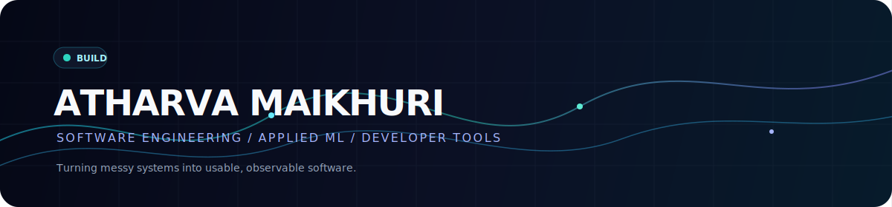

  
  

    <a href="https://www.linkedin.com/in/atharva-maikhuri/">LinkedIn</a> ·
    <a href="mailto:atharvamaik200@gmail.com">Email</a> ·
    <a href="https://github.com/AtharvaMaik">Repositories</a>
  

  <em>I turn messy systems into useful, observable software.</em>

## The short version

I build across applied ML, backend engineering, developer experience, and data reliability. The common thread is end-to-end ownership: a clear problem, a usable interface, a real pipeline, and enough evidence to trust the result.

  <table>
    <tr>
      <td align="center" width="33%"><strong>01</strong> Developer tools <small>AI workflows, CLIs, proof-of-done systems</small></td>
      <td align="center" width="33%"><strong>02</strong> Applied ML <small>Model serving, inference, retrieval, evaluation</small></td>
      <td align="center" width="33%"><strong>03</strong> Reliable systems <small>Data quality, observability, automation, ops</small></td>
    </tr>
  </table>

## Featured builds

<table>
  <tr>
    <td width="50%" valign="top">
      <a href="https://github.com/AtharvaMaik/donecheck"><strong>donecheck</strong></a> 
      Proof-of-done for AI coding agents.  
      
      
      
Local evidence receipts for Codex, Claude Code, Cursor, and GitHub Actions.

    </td>
    <td width="50%" valign="top">
      <a href="https://github.com/AtharvaMaik/PromptQueue"><strong>PromptQueue</strong></a> 
      A dependency-free prompt scheduler.  
      
      
      
Queues prompts for AI rate-limit resets across the tools developers already use.

    </td>
  </tr>
  <tr>
    <td width="50%" valign="top">
      <a href="https://github.com/AtharvaMaik/gh-suggest"><strong>gh-suggest</strong></a> 
      Staged fixes → reviewable PR suggestions.  
      
      
      
A GitHub CLI extension focused on shortening the path from local change to collaboration.

    </td>
    <td width="50%" valign="top">
      <a href="https://github.com/AtharvaMaik/rtk"><strong>rtk</strong></a> 
      A Rust token-saving CLI proxy.  
      
      
      
A single binary for reducing repetitive LLM token usage in everyday development commands.

    </td>
  </tr>
  <tr>
    <td width="50%" valign="top">
      <a href="https://github.com/AtharvaMaik/HFTminion"><strong>HFTminion</strong></a> 
      Alternative-data reliability control plane.  
      
      
      
Trust scoring, feed monitoring, incident replay, and safer decisions for downstream research.

    </td>
    <td width="50%" valign="top">
      <a href="https://github.com/AtharvaMaik/AIDetect"><strong>AIDetect</strong></a> 
      A deployed RoBERTa text detector.  
      
      
      
Long-document inference, suspicious-span grouping, and a usable FastAPI + React product.

    </td>
  </tr>
</table>

## Live activity

  

  Generated automatically every 6 hours by <code>.github/workflows/update-profile-activity.yml</code>.

  
<strong>More builds</strong>

- [ResumeGod](https://github.com/AtharvaMaik/ResumeGod) — structured AI workflow for targeted LaTeX resumes.
- [fenn](https://github.com/AtharvaMaik/fenn) — Python framework for ML/DL workflows and LLM agents.
- [securNet](https://github.com/AtharvaMaik/securNet) — security observability and incident simulation.
- [AutoQart-UI](https://github.com/AtharvaMaik/AutoQart-UI) — Java/Selenium automation with CI and failure evidence.
- [Financial Reporting and Analytics Hub](https://github.com/AtharvaMaik/Financial-Reporting-and-Analytics-Hub) — market-data ingestion and leadership reporting.
- [Valance](https://github.com/AtharvaMaik/Valance) — local-first Android expense manager.
- [COPYHERR](https://github.com/AtharvaMaik/COPYHERR) — local persona training with fine-tuning and retrieval memory.
- [OPCUA-Server](https://github.com/AtharvaMaik/OPCUA-Server) — Windows simulator for browsable OPC UA nodes.
- [TheHub](https://github.com/AtharvaMaik/TheHub) · [EcomRec](https://github.com/AtharvaMaik/EcomRec) · [InvestPro](https://github.com/AtharvaMaik/InvestPro) · [RegimeGaurd](https://github.com/AtharvaMaik/RegimeGaurd) · [CurlSentinel](https://github.com/AtharvaMaik/CurlSentinel) · [DjangoNotes](https://github.com/AtharvaMaik/DjangoNotes) · [NoMoreShorts](https://github.com/AtharvaMaik/NoMoreShorts)

## Stack

  <code>Python</code> · <code>TypeScript</code> · <code>JavaScript</code> · <code>Java</code> · <code>C#</code> · <code>SQL</code> 
  <code>FastAPI</code> · <code>React</code> · <code>Next.js</code> · <code>TensorFlow</code> · <code>PostgreSQL</code> · <code>Docker</code> · <code>Terraform</code> · <code>GitHub Actions</code>

## Currently

- Studying Computer Science at Manipal Institute of Technology, Bengaluru.
- Building practical systems across applied ML, backend engineering, data workflows, and developer experience.
- Open to software engineering and machine learning internships from July–December 2026.

  <a href="https://github.com/AtharvaMaik?tab=repositories">Explore all repositories →</a>

