<div align="center">


</div>

```bash
atharva@github:~$ whoami
Machine learning and full-stack engineer building deployed, documented, portfolio-ready systems.

atharva@github:~$ focus --current
AI text detection | recommendation engines | local AI workflows | industrial simulation | product-grade web apps

atharva@github:~$ status --2026
83 contributions | 76 commits | 7 repository contributions | 9 active days | best day: 35 contributions on 2026-04-23
```

## ./about

I build practical software projects that connect model behavior, product experience, and reliable backend systems. My work spans transformer inference, recommendation systems, private local AI experimentation, OPC UA simulation, and full-stack web applications.

The common thread: projects should be usable, explainable, and deployable. I like clean APIs, clear setup paths, realistic data flows, and documentation that shows the engineering decisions instead of hiding them.

## ./activity_2026

<div align="center">



</div>

<sub>2026 stats are regenerated automatically by GitHub Actions.</sub>


## ./projects

| Project | Terminal summary | Stack |
| --- | --- | --- |
| [`AIDetect`](https://github.com/AtharvaMaik/AIDetect) | Fine-tuned RoBERTa AI-text detector with chunked long-document inference and suspicious-region grouping. | RoBERTa, FastAPI, React, Docker |
| [`EcomRec`](https://github.com/AtharvaMaik/EcomRec) | Ecommerce recommendation platform with explainable cart, history, and recent-view ranking. | React, Express, SQLite, TF-IDF |
| [`COPYHERR`](https://github.com/AtharvaMaik/COPYHERR) | Private local WhatsApp persona training and RAG experimentation pipeline. | Python, Node.js, Unsloth, Ollama |
| [`OPCUA-Server`](https://github.com/AtharvaMaik/OPCUA-Server) | Windows simulator for exposing AML/MTP-style data as browsable OPC UA nodes. | C#, .NET, WPF, OPC UA |
| [`TheHub`](https://github.com/AtharvaMaik/TheHub) | Social movie watchlist app with auth, sharing, and real-time data. | React, TypeScript, Supabase |
| [`DjangoNotes`](https://github.com/AtharvaMaik/DjangoNotes) | Minimal notes app with AJAX CRUD and REST-style endpoints. | Django, jQuery, Bootstrap |

## ./stack

```text
Languages       Python | JavaScript | TypeScript | C# | HTML | CSS | SQL
Frontend        React | Vite | Tailwind CSS | Bootstrap | jQuery
Backend         FastAPI | Express | Django | Supabase | SQLite
ML / Data       Transformers | PyTorch | TF-IDF | RAG | Ollama | Unsloth
Systems         .NET | WPF | OPC UA | Docker | Vercel | Hugging Face Spaces
```


## ./contact

```bash
atharva@github:~$ open channels
linkedin  -> https://www.linkedin.com/in/atharva-maikhuri/
discord   -> .clashking
github    -> https://github.com/AtharvaMaik
```

<div align="center">


</div>